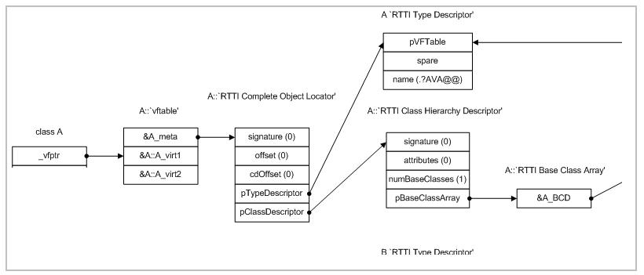

# RTTI与虚函数
RTTI机制为每一个类型产生一个type_info类型的数据，而typeid查询返回的变量相应type_info数据，通过name成员函数返回类型的名称。RTTI通过使用 typeid 或者 dynamic_cast 完成。

**type_info结构中含有RTTICompleteObjectLocator，`包含当前类型的名称以及基类与派生类RTTI对象的地址`，可以利用一个实例的RTTI信息去复原整个类继承图谱。 虚表以及RTTI info 是在对象创建的时调用构造函创建的。**

1.  RTTI 在某些单元测试中非常有用. 比如进行工厂类测试时, 用来验证一个新建对象是否为期 望的动态类型. RTTI 对于管理对象和派生对象的关系也很有用.
2.  在运行时判断类型通常意味着设计问题. 如果你需要在运行期间确定一个对象的类型, 这通 常说明你需要考虑重新设计你的类.
3.  RTTI会影响效率（ **dynamic_cast会比较虚函数表,也就是一层一层匹配v-table,开销巨大** ，另一方面基于RTTI来不断的ifelse或者switch来判断类型这种方法效率低，而且类型扩展时，需要更改和维护。可以用注册表或者模板泛型来遍历）
4.  RTTI会抛出异常
5.  google认为能确保安全的情况下用dynamic_cast作为RTTI的替代方案

[对《深入C++对象模型》中的一个疑问——虚函数表的type_info的位置](http://blog.csdn.net/coderjeff/article/details/46544171)

**虚表地址减1之后才得到类型信息**

如果你的 代码需要根据不同的对象类型执行不同的行为的话, 请考虑用以下的两种替代方案之一查 询类型:
1.  虚函数可以根据子类类型的不同而执行不同代码. 这是把工作交给了对象本身去处理.
2.  如果这一工作需要在对象之外完成, 可以考虑使用双重分发的方案, 例如使用访问者设计模 式. 这就能够在对象之外进行类型判断.
3.  如果程序能够保证给定的基类实例实际上都是某个派生类的实例, 那么就可以自由使用 dynamic_cast. 在这种情况下, 使用 dynamic_cast 也是一种替代方案.

----

虚函数表的指针存在于对象实例中最前面的位置。
通过对象实例的地址可以得到这张虚函数表，然后就可以遍历其中函数指针，并调用相应的函数。
    (Fun)*((int*)*(int*)(&b)+0); // Base::f()
    (Fun)*((int*)*(int*)(&b)+1); // Base::g()
    (Fun)*((int*)*(int*)(&b)+2); // Base::h()
每个类都会有虚表，若派生类覆盖了基类虚函数，那么在派生类的虚表中，相应函数地址会变成派生类函数

*   无覆盖

*   有覆盖

一个派生类对象的虚表（完整的，不仅仅是虚函数表）包含了自己和基类的RTTI，所以可以在这个表中遍历整个继承树

[运行时类型识别（RTTI）与动态类型转换原理](http://www.cnblogs.com/malecrab/p/5574070.html)