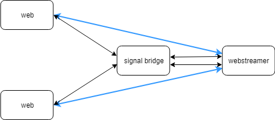
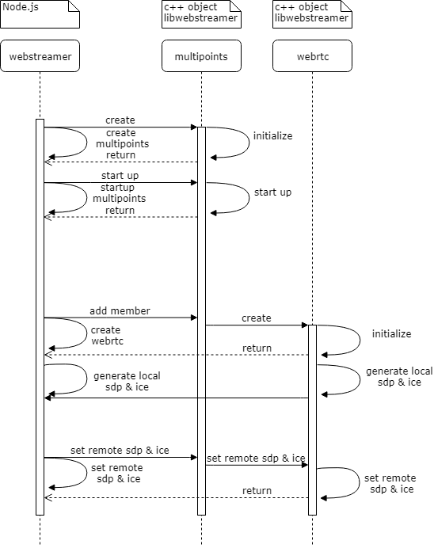

## 原理设计
这里利用RTCMultiConnection的demo `Video-Conferencing` 进行改造来实现多点连接。原始demo界面如下，分为open room和join room两个操作，每个用户都能看到所有参与者的画面。

  


我们这里将其进行简化，每个房间限制为只能有两个参与者进行一对一的链接，一端为网页用户，一端为gstreamer webrtc。


将多个gstreamer webrtc并联在一起就形成了多点连接的形式。这里原来room的概念退化成了connection，而多个connection由webstreamer一起控制就形成了多点连接的room的概念。


## 时序图
访问 `http://localhost:9001/demos/Video-Conferencing.html` ，加载video conference的页面，然后填写room id为1，点击join room。这里网页上的room id就是我们上面所说的connection id，注意这里点击的是join room，而不是open room。



从时序图上面可以看出，整个过程分为两个阶段，第一个阶段，chrome和webstreamer通过signal bridge经过四条消息的交互，建立了一个connection连接；第二个阶段就是chrome和webstreamer进行webrtc的信令交互。  

所有交互消息为JSON格式，并且具有统一形式：
```json
{
    "remoteUserId": "",
    "message": {},
    "sender": ""
}
```
remoteUserId、message和sender这三个属性必不可少，其他的属性还可以再添加。
### 建立连接
#### msg1
```json
{
    "remoteUserId": "1",
    "message": {
        "newParticipationRequest": true,
        "isOneWay": false,
        "isDataOnly": false,
        "localPeerSdpConstraints": {
            "OfferToReceiveAudio": true,
            "OfferToReceiveVideo": true
        },
        "remotePeerSdpConstraints": {
            "OfferToReceiveAudio": true,
            "OfferToReceiveVideo": true
        }
    },
    "sender": "49h2hqiv3fb",
    "password": false
}
```

这是chrome发出的第一条消息，也就是点击join room后向signal bridge发出的消息。  
*   `"remoteUserId": "1"` 表示加入id为1的connection  
*   `"sender": "49h2hqiv3fb"` 为chrome生成的id  
*   `"password": false` 表示加入这个connection不需要密码  
*   `"message"` 中的信息为码流配置选项

#### msg2
```json
{
    "remoteUserId": "49h2hqiv3fb",
    "message": {
        "enableMedia": true,
        "userPreferences": {
            "extra": {},
            "localPeerSdpConstraints": {
                "OfferToReceiveAudio": true,
                "OfferToReceiveVideo": true
            },
            "remotePeerSdpConstraints": {
                "OfferToReceiveAudio": true,
                "OfferToReceiveVideo": true
            },
            "isOneWay": true,
            "isDataOnly": false,
            "dontGetRemoteStream": false,
            "dontAttachLocalStream": false,
            "connectionDescription": {
                "remoteUserId": "2",
                "message": {
                    "newParticipationRequest": true,
                    "isOneWay": false,
                    "isDataOnly": false,
                    "localPeerSdpConstraints": {
                        "OfferToReceiveAudio": true,
                        "OfferToReceiveVideo": true
                    },
                    "remotePeerSdpConstraints": {
                        "OfferToReceiveAudio": true,
                        "OfferToReceiveVideo": true
                    }
                },
                "sender": "49h2hqiv3fb",
                "password": false
            }
        }
    },
    "sender": "1"
}
```
msg2是webstreamer向chrome发出的消息，等同于点击open room后，网页发出的消息。这里webstreamer就模拟了另一个chrome网页来与第一个chrome网页配对。  

webstreamer连接signal bridge时会通过url中的参数来表示自己的connection id为1，然后signal bridge会转发msg1给webstreamer，webstreamer从中提取必要的信息才能创建msg2

*   `"remoteUserId": "49h2hqiv3fb"` remoteUserId从msg1的sender中提取
*   `"sender": "1"` webstreamer当前连接的id即为connection id
*   `"message"` 中的信息为webstreamer端码流配置选项，userPreferences中的信息大部分与msg1中相同，其中connectionDescription就是msg1

这些消息中除了remoteUserId和sender意外，其余的都是固定的，按照模版填写就可以。

#### msg3
```json
{
    "remoteUserId": "1",
    "message": {
        "readyForOffer": true,
        "userPreferences": {
            "extra": {},
            "localPeerSdpConstraints": {
                "OfferToReceiveAudio": true,
                "OfferToReceiveVideo": true
            },
            "remotePeerSdpConstraints": {
                "OfferToReceiveAudio": true,
                "OfferToReceiveVideo": true
            },
            "isOneWay": true,
            "isDataOnly": false,
            "dontGetRemoteStream": false,
            "dontAttachLocalStream": false,
            "connectionDescription": {
                "remoteUserId": "1",
                "message": {
                    "newParticipationRequest": true,
                    "isOneWay": false,
                    "isDataOnly": false,
                    "localPeerSdpConstraints": {
                        "OfferToReceiveAudio": true,
                        "OfferToReceiveVideo": true
                    },
                    "remotePeerSdpConstraints": {
                        "OfferToReceiveAudio": true,
                        "OfferToReceiveVideo": true
                    }
                },
                "sender": "49h2hqiv3fb",
                "password": false
            },
            "streamsToShare": {
                "Acwdwt3353iDwuJciVX3l1G6wLO5A8P34TbM": {
                    "isAudio": false,
                    "isVideo": true,
                    "isScreen": false
                }
            }
        }
    },
    "sender": "49h2hqiv3fb"
}
```
#### msg4
```json
{
    "remoteUserId": "49h2hqiv3fb",
    "message": "next-possible-initiator",
    "sender": "1"
}
```
### webrtc交互


