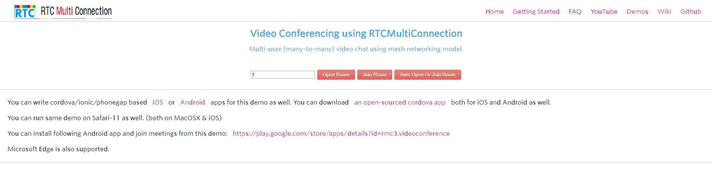
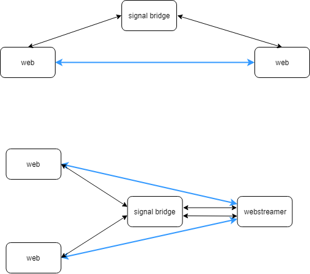

## 原理设计
这里利用RTCMultiConnection的demo `Video-Conferencing` 进行改造来实现多点连接。原始demo界面如下，分为open room和join room两个操作，每个用户都能看到所有参与者的画面。



我们这里将其进行简化，每个房间限制为只能有两个参与者进行一对一的链接，一端为网页用户，一端为gstreamer webrtc，将多个gstreamer webrtc并联在一起就形成了多点连接的形式。这里原来room的概念退化成了connection，而多个connection由webstreamer一起控制就形成了多点连接的room的概念。




## 时序图
访问 `http://localhost:9001/demos/Video-Conferencing.html` ，加载video conference的页面，然后填写room id为1，点击join room。这里网页上的room id就是我们上面所说的connection id，注意这里点击的是join room，而不是open room。


从时序图上面可以看出，整个过程分为两个阶段，第一个阶段，chrome和webstreamer通过signal bridge经过四条消息的交互，建立了一个connection连接；第二个阶段就是chrome和webstreamer进行webrtc的信令交互。  

所有交互消息为JSON格式，并且具有统一形式：
```json
{
    "remoteUserId": "",
	"message": {},
	"sender": ""
}
```
remoteUserId、message和sender这三个属性必不可少，其他的属性还可以再添加。

```json
{
    "remoteUserId": "1",
    "message": {
        "newParticipationRequest": true,
        "isOneWay": false,
        "isDataOnly": false,
        "localPeerSdpConstraints": {
            "OfferToReceiveAudio": true,
            "OfferToReceiveVideo": true
        },
        "remotePeerSdpConstraints": {
            "OfferToReceiveAudio": true,
            "OfferToReceiveVideo": true
        }
    },
    "sender": "49h2hqiv3fb",
    "password": false
}
```
这是chrome发出的第一条消息，remoteUserId为1表示加入的connection id为1；sender为chrome生成的id；password为false表示加入这个connection不需要密码；而message中为码流配置选项。


## 接口设计

