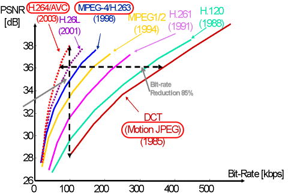

# Container format (封装格式)
Container format 描述了视频文件的结构。正如它的字面含义所说，它是对一个“容器”的规范。一个**视频文件**往往会包含**图像和音频**，还有一些**配置信息**(如图像和音频的关联，如何解码它们等)：这些内容需要**按照一定的规则组织、存储起来**，Container format就是这些规则。如果一个视频文件是以某个Container format封装起来的，那么它的后缀名一般会体现出来，如mp4,rmvb,mkv,avi等。 

**封装格式不影响视频的画质，它只负责把视频轨和音频轨集成在一起，只起到一个文件夹（或者压缩包）的作用，并没有对视频轨或音频轨造成影响。**  

* `AVI(Audio Video Interleave)`:音频视频交错格式，只能封装一条视频轨和音频轨，不能封装文字，没有任何控制功能，因而也就无法实现流媒体，其文件扩展名是`.avi`。
* `WMV(Windows Media Video)`:具有数字版权保护功能，其文件扩展名是`.wmv/.asf`。
* `MPEG(Moving Picture Experts Group)`:可以支持多个视频、音轨、字幕等，控制功能丰富，其文件扩展名是`.MPG .MPEG .MPE .DAT .VOB .ASF .3GP .MP4 `。**RTSP一般传输ts、mp4格式的流。**
* `Matroxska`:提供非常好的交互功能，比MPEG更强大，其文件扩展名是`.mkv`。
* `QuickTime File Farmat`:由Apple开发，可存储内容丰富，支持视频、音频、图片、文字等，其文件扩展名是`.mov`。
* `FLV(Flash Video)`:由Adobe Flash延伸而来的一种视频技术，主要用于网站。**RTMP一般传输flv、f4v格式流。**
* `Real Video`:只能容纳Real Video和Real Audio编码格式的媒体，其文件扩展名是`.rmvb`。rmvb这种格式方便之处在于体积小，不能修改的内置字幕，而且只能达到DVD的画质。  
* `MPEG2-TS` :格式 (后缀为 `.ts`)（ Transport Stream “传输流”；又称 MTS 、 TS ）是一种传输和存储包含音效、视频与通信协议各种数据的标准格式，用于数字电视广播系统，如 DVB 、 ATSC 、 IPTV 等等。 MPEG2-TS 定义于 MPEG-2 第一部分，系统（即原来之 ISO/IEC 标准 13818-1 或 ITU-T Rec. H.222.0 ）。  

[container_formats](https://en.wikipedia.org/wiki/Comparison_of_video_container_formats)  
[ref](https://www.v2ex.com/t/303205)  

# Codec (编解码格式)
Codec是一种压缩标准。而文件的压缩/还原是通过编/解码实现的，所以Codec也可理解成**视频文件的编/解码标准**（数字存储空间、帧速率、比特率、分辨率等）。不同的标准对于压缩的质量和效率有影响。 

世界上有两大制定这套标准的阵营：  
* **ITU-T** VCEG(Visual Coding Experts Group，国际电联旗下的标准化组织)   
* **MPEG**(Moving Picture Experts Group, ISO旗下的组织)。 

H.26x系列标准是ITU-T制定的，MPEG系列标准是MPEG制定的。 

## H.26X系列
H.26X系列（由ITU[国际电传视讯联盟]主导）包括H.261、H.262、H.263、H.264、H.265。  

1) H.261：主要在老的视频会议和视频电话产品中使用。
2) H.263：主要用在视频会议、视频电话和网络视频上。
3) **H.264**：H.264/MPEG-4第十部分，或称**AVC**（Advanced Video Coding，高级视频编码），是一种视频压缩标准，一种被广泛使用的高精度视频的录制、压缩和发布格式。
4) **H.265**：高效率视频编码（High Efficiency Video Coding，简称**HEVC**）是一种视频压缩标准，H.264/MPEG-4 AVC的继任者。HEVC被认为不仅提升图像质量，同时也能达到H.264/MPEG-4 AVC两倍之压缩率（等同于同样画面质量下比特率减少了50%），可支持4K分辨率甚至到超高画质电视，最高分辨率可达到8192×4320（8K分辨率），这是目前发展的趋势。H.265是次世代标准MPEG-H的第2部分，不属于MPEG-4标准，有着比H.264更强的压缩效率。

## MPEG系列
MPEG是压缩运动图像及其伴音的视音频编码标准，它采用了**帧间压缩**，仅存储连续帧之间有差别的地方 ，从而达到较大的压缩比。MPEG现有MPEG—1、MPEG—2和MPEG—4三个版本，以适应于不同带宽和图像质量的要求。

1) MPEG-1第二部分（MPEG-1第二部分主要使用在VCD上，有些在线视频也使用这种格式。该编解码器的质量大致上和原有的VHS录像带相当。）
1) MPEG-2第二部分（MPEG-2第二部分等同于H.262，使用在DVD、SVCD和大多数数字视频广播系统和有线分布系统（cable distribution systems）中。）
1) **MPEG-4第二部分**（MPEG-4第二部分标准可以使用在网络传输、广播和媒体存储上。比起MPEG-2和第一版的H.263，它的压缩性能有所提高。）
1) **MPEG-4第十部分**（MPEG-4第十部分技术上和ITU-T H.264是相同的标准，有时候也被叫做“AVC”）最后这两个编码组织合作，诞生了H.264/AVC标准。ITU-T给这个标准命名为H.264，而ISO/IEC称它为MPEG-4 高级视频编码（Advanced Video Coding，AVC）。

MPEG4是一整套视频压缩规范，它包含的标准从ISO-IEC-14496-1 到 ISO-IEC-14496-10。
**注意这里MPEG4的编码格式也分为两种，只有MPEG4第十部分（ISO-IEC-14496-10）才称为H.264/AVC，而另一个（ISO-IEC-14496-2）则可以成为`传统意义上的MPEG4`。**  

## MJPEG
MJPEG源于JPEG压缩技术，是一种简单的**帧内JPEG压缩**。其主要特点是基本不考虑视频流中不同帧之间的变化，只单独对某一帧进行压缩，其压缩倍数为20~80倍，适合静态画面的压缩，不适合长时间连续录像的需求，不大适用于视频图像的网络传输。因为每一帧独立出来，所以可以任意剪接编辑，图像清晰度也会比JPEG的高(适用于视频编辑)。  

---

| 项目       | H.264 | MPEG4 | MJPEG |
| ---------- | ----- | ----- | ----- |
| 同码率画质 | 优    | 中    | 差    |
| 复杂度     | 高    | 中    | 低    |
| 传输速度   | 快    | 中    | 慢    |
| 成本       | 高    | 中    | 低    |

  

同码率下H264、MPEG4和MJPEG的图像质量  
  
  
  

---

X264是H264的另外一种开源编码格式,其开头的"X"意思是"software",是使用CPU软解码的一种视频格式,特征是编码速度相当 快但解码很慢并相当耗费CPU处理能力,X264不支援硬件加速,是和RMVB一样的强解码类型

---
# Media
## ES
ES--Elementary  Streams  (原始流)是`直接从编码器出来的数据流`，可以是编码过的视频数据流（H.264,MJPEG等），音频数据流（AAC），或其他编码数据流的统称。   
**ES是只包含一种内容的数据流**。  
每个ES都由若干个存取单元（AU）组成，每个视频AU或音频AU都是由头部和编码数据两部分组成，1个AU相当于编码的1幅视频图像或1个音频帧，也可以说，**每个AU实际上是编码数据流的显示单元**，即相当于解码的1幅视频图像或1个音频帧的取样。

## PES
PES--Packetized  Elementary Streams  (分组的ES)，ES形成的分组称为PES分组，是`用来传递ES的一种数据结构`。PES流是`ES流经过PES打包器处理后形成的数据流`，在这个过程中完成了将ES流分组、打包、加入包头信息等操作（对ES流的第一次打包）。**PES流的基本单位是PES包。PES包由包头和payload组成。**`打包之后的PES也是只含一种性质的ES。`

## PS
PS--Program Stream(节目流)PS流由PS包组成，而一个PS包又由若干个PES包组成（到这里，ES经过了两层的封装）。PS包的包头中包含了同步信息与时钟恢复信息。一个PS包最多可包含具有同一时钟基准的16个视频PES包和32个音频PES包。

## TS
TS--Transport Stream（传输流）由定长的TS包组成（188字节），而TS包是对PES包的一个重新封装（到这里，ES也经过了两层的封装）。PES包的包头信息依然存在于TS包中。

TS流与PS流的区别在于**TS流的包结构是固定长度的,而PS流的包结构是可变长度的**。  
PS包由于长度是变化的,一旦丢失某一PS包的同步信息,接收机就会进入失步状态,从而导致严重的信息丢失事件。  
而TS码流由于采用了固定长度的包结构,当传输误码破坏了某一TS包的同步信息时,接收机可在固定的位置检测它后面包中的同步信息,从而恢复同步,避免了信息丢失。  
**因此在信道环境较为恶劣、传输误码较高时一般采用TS码流,而在信环境较好、传输误码较低时一般采用PS码流。**

todo  
- [x] h264 和mpeg4的关系  
- [x] mpeg4和mjpg  
- [ ] x264 openh264  
- [x] avc hevc什么意思  
- [x] 各种容器格式的优势和内部结构  
- [ ] h264 mjpg原理  
- [x] ts ps
- [ ] RTMP/HTTP-FLV  HLS
- [x] mjpg gstreamer实现  